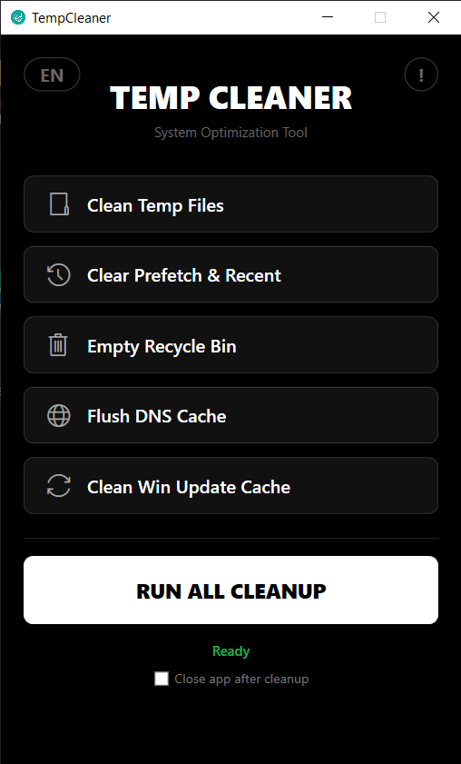

# Temp Cleaner Version 1.0

A lightweight, modern, and powerful system optimization tool built with C# and WPF. Featuring a "Pitch Black" UI designed for efficiency and aesthetics.

 

 

## Features

- **User & System Temp Cleaning:** Safely removes temporary files to free up space.
- **Prefetch & Recent Items:** Clears Windows cache and recent file history.
- **Recycle Bin:** Empties the bin with a single click.
- **DNS Flush:** Refreshes your network connection by flushing the DNS cache.
- **Windows Update Cache:** Safely stops services and clears the update download folder.
- **Freed Space Calculator:** Displays exactly how much space was recovered.
- **Modern UI:** Minimalist OLED-friendly design with intuitive controls.

## How to use

1. Download the latest version from the **Releases** section.
2. Run `TempCleaner.exe` as Administrator.
3. Click "RUN ALL CLEANUP" or choose specific tasks.

## Built With

- **Language:** C#
- **Framework:** .NET 8 (WPF)
- **UI Theme:** Pitch Black (Custom Styled)

## Developer

**Ali Al-ojeely (Mr.Ghost)**

- Email: <alialojeely@gmail.com>
- GitHub: [AliAl-ojeely](https://github.com/AliAl-ojeely)